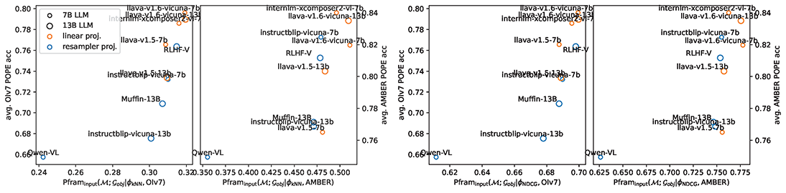

Understanding Multimodal Hallucination with Parameter-Free Representation Alignment (Pfram)
---

[](https://arxiv.org/abs/2409.01151)

# Introduction
Parametric-free representation alignment metric (Pfram) is a metric that can measure the alignment of a neural representation system with a human representation system without requiring additional training parameters, which reflects the ability of the neural representation system to represent a certain aspect of images. 


As shown in the above scatter plot, when using human-annotated object labels ($\mathcal{G}_{obj}$) as the human representation system to measure the object recognizing ability of visual encoders ($\mathcal{M}$) of multimodal large language models (MLLMs), Pfram shows strong and robust correlation with MLLM object hallucination ([POPE acc](https://arxiv.org/abs/2305.10355)) across different similarity metrics ($\mathcal{\phi}$) and image datasets (OIv7/AMBER).

For more details and usages of Pfram, please refer to [our paper](https://arxiv.org/abs/2409.01151).

# Installation
```bash
conda create -n pfram python=3.10
conda activate pfram
pip install -r requirements.txt
```
If you want to reproduce the results of LLaVA, Muffin and RLHF-V, clone their repositories and link their source code to `utils/`:

```bash
git clone https://github.com/haotian-liu/LLaVA.git
ln -s LLaVA/llava utils/

git clone https://github.com/thunlp/Muffin.git
ln -s Muffin/muffin utils/
```

# Data Preparing
## Prepare Data for Pfram
*Note: "Pfram" in this document refers to Pfram(F, G_obj) in the paper, i.e. using object annotations as ground truth representation system.*

We provide our preprocessed data for Pfram in `output/`. If you want to prepare the data by yourself, follow the steps below.

- OpenImages
  - Download OpenImages V7 data from [Official Website](https://storage.googleapis.com/openimages/web/download_v7.html#image-labels-subset). To reproduce our results, you only need to download **Boxable class names** (`oidv7-class-descriptions-boxable.csv`), **Human-verified labels** (`oidv7-val-annotations-human-imagelabels.csv`) and **images** of the validation set. Save them in the same folder.
  - Run `python tools/openimages_process.py --input_folder OPENIMAGES_DATA_FOLDER --output_folder output/oi` for data prepeocessing. This code contains the following functionalities:
    1. Random sampling 1600 images with more than 5 objects, and save their file names
    1. Calculate their ground truth similarities according to common objects, and save the results in `output/oi`.


- AMBER
  - Download AMBER data from [Official Website](https://github.com/junyangwang0410/AMBER). To reproduce our results, you only need to download **`data/annotations.json`** and **images**. Save them in the same folder.
  - Run `python tools/amber_preprocess.py --input_folder AMBER_DATA_FOLDER --output_folder output/amber` for data processing, which is similar to OpenImages.

- Use your own dataset
    - Refer to `tools/openimages_proces.py` and modify the code to load your data.

## Prepare Data for POPE
Code related to POPE is in `POPE/` folder. See [POPE/DATA.md](POPE/DATA.md).


# Get Image Representations of Models

- Get the image representations from layers in visual encoders:
```bash
python -u visual_embed.py --get_embed_per_layer \
--image_base_folder OPENIMAGES_IMAGE_FOLDER \
--image_fnames output/oi/image_fname.json \
--model_name Salesforce/instructblip-vicuna-7b \
--output_folder output/oi/instructblip-vicuna-7b-visual_encoder/
```
and the results (`sims-layer_%d.npy`, `rank-layer_%d.npy`) are stored in `output/oi/instructblip-vicuna-7b-visual_encoder`. You can change `model_name` and `output_folder` as you want.


- Get the image representation from layers in LLMs:
```bash
python -u visual_embed.py --add_llm --llm_layer 32 28 24 20 \
--image_base_folder OPENIMAGES_IMAGE_FOLDER \
--image_fnames output/oi/image_fname.json \
--model_name Salesforce/instructblip-vicuna-7b \
--output_folder output/oi/instructblip-vicuna-7b-llm/
```
and the results (`sims-layer_%d.npy`, `rank-layer_%d.npy`) are stored in `output/oi/instructblip-vicuna-7b-llm`. You can change `model_name` and `output_folder` as you want.

**Note that** the hidden size of LLM is relatively large, so your memory may not be large enough to save image representations of all layers at a time. For example, for LLaVA v1.5 13B, each layer's image representations takes about 1600 (num images) * 5120 (hidden size) * 576 (patches per image) * 2 Byte (per fp16 number) = ~9GB of memory. So it is suggested to calculate at most 4 layers at a time by setting only 4 layer numbers after `--llm_layer`.


# Inference on POPE
Code related to POPE is in `POPE/` folder. See [POPE/DATA.md](POPE/DATA.md).


# Analyze the Results

## Stat the Pfram metric from rank and sim matrices
Read and modify `stat/stat_result.py`. Set the `METRIC` as `'knn'` or `'ndcg'` to choose the similarity metric you want to use. Then execute:
```bash
python stat/stat_result.py
```
and check the results in `stat/stat_result.json`. The results for each model on each dataset should look like this:
```json
{
"visual_encoder": {
  // "layer": {"k": result, "k": result}
  "4": {"25": 7.34, "50": 10.49, ... (results for other k)},
  "8": {"25": 9.3, "50": 12.91, ...},
  ... (results for other layers)
},
"llm": {
  // the same data format as "visual encoder"
}
}
```


## Calculate the relevance score between Pfram and POPE
- Create a python code file `stat/data.py` that stores Pfram and POPE results in the following format:
```python
OI_OBJECT = {   # (copied from `stat/stat_result.json`)
    "instructblip-vicuna-7b": {"visual_encoder": {...}, "llm": {...}},
    "instructblip-vicuna-13b":  {"visual_encoder": {...}, "llm": {...}},
    ... (other models)
}

OI_POPE_ACC = {
    'instructblip-vicuna-7b': [0.849, 0.709, 0.613],   # random, popular, and adversarial score
    'instructblip-vicuna-13b': [0.759, 0.667, 0.569],
    ... (other models)
}
```

- Check the code in `stat/relevance_test.py`. Modify `llm_value_func` function if you want to use alternative k (in k-NN or NDCG@k) or LLM layers.

- Run `python stat/relevance_test.py` and get the correlation coefficient between Pfram and POPE.


# Citation
If you find this code useful in your research, please cite:
```bibtex
@misc{wang2024pfram,
      title={Understanding Multimodal Hallucination with Parameter-Free Representation Alignment},
      author={Yueqian Wang and Jianxin Liang and Yuxuan Wang and Huishuai Zhang and Dongyan Zhao},
      year={2024},
      eprint={2409.01151},
      archivePrefix={arXiv},
      primaryClass={cs.CV},
      url={https://arxiv.org/abs/2409.01151},
}
```